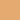
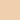
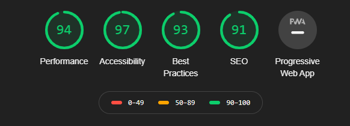

# CatsUnion

---

## Table of Contents

---

1. [UX](#UX)
    - [User Stories](#UserStories)
    - [Viability](#viability)
    - [Frameworks](#frameworks)
    - [Typography](#typography)
    - [Colors](#colors)
    - [Wireframes](#wireframes)
    - [Logo](#Logo)
2. [Features](#Features)
    - [Existing Features](#existing)
    - [Features left to implement](#features-implement)
3. [Technologies Used](#technologies)
    - [Front End Technologies](#FEtech)
4. [Testing](#testing)
    - [Validators](#validators)
    - [Testing Methods](#testing-methods)
5. [Deployment](#deploy)
    - [Local Deployment](#local)
    - [Remote Deployment](#remote)
6. [Credits](#credits)
    - [Content](#content)
    - [Media](#Media)
    - [Acknowledgements](#Acknowledgements)

---

## UX

---

### User Stories 

- As a user I want to be able to adopt a Cat or a Kitten to care for.

- As a user I want to be able to donate to the charity so I can give my support.

- As a user I want to be able to sponsor a Cat to a Kitten so I can give support to a specific cat the charity cares for.

- As a user I want some support in how to best take care of Cats and Kittens.

- As a user I want to be able to contact the charity.

- As a user I want the website to run on different screen sizes.

- As a user, I want to be able to apply to volunteer my times to help the charity.

- As a user, I want to be able to raise funds in other ways so I can give support to the charity.

### Project Viability

|     | Feature                        | Importance | Viability |
| --- | ------------------------------ | :--------: | --------: |
| A   | Information about the charity  |     5      |         5 |
| B   | Generate money for the charity |     5      |         4 |
| C   | Adoption Info                  |     3      |         4 |
| D   | Responsive Application Form    |     5      |         4 |
| E   | Location and contact info      |     3      |         4 |
| F   | Cat Care support               |     2      |         4 |
|     | Total                          |     23     |        26 |

### Frameworks Used

* [Bootstrap](https://getbootstrap.com/)

### Typography

The following [webpage](https://www.websitebuilderexpert.com/designing-websites/pick-best-font-style-for-website/) was useful in order to decide which font style to select. A display type was chosen due to its friendly accessible approach, and sans-Serif as the backup font.

* 1 [Google Font](https://fonts.google.com/) was used throughout this website: 
- [Patua One](https://fonts.google.com/specimen/Patua+One?category=Display&sidebar.open&selection.family=DM+Serif+Display|Kaushan+Script|Patua+One)

### Colours

The following [website](https://www.canva.com/colors/color-wheel/) was useful in order to decide which colours I used for my website.

*   Navbar
*  Buttons
*   Footer
*   Donate-Panel

### Icons

* [Font Awesome 5.13.1](https://fontawesome.com/)
    The following 4 Fontawesome icons were used.
    - [map](https://fontawesome.com/icons/map?style=solid) - Used in the Contact Us modal
    - [phone](https://fontawesome.com/icons/phone?style=solid) - Used in the Contact Us modal
    - [mail](https://fontawesome.com/icons/envelope?style=solid) - Used in the Contact Us modal
    - [copyright](https://fontawesome.com/icons/copyright?style=solid) - Used in the footer

### Wireframes

* Click here to see the project [Wireframes](wireframes.md)

### Logo

* Used [Gimp](https://www.gimp.org/) to create the logo by editing [this](https://pixabay.com/vectors/heart-love-cats-kitten-kitty-2766277/) image. The website font from googlefonts was then added to gimp and then inserted underneath the image to create the logo. 

---

## Features

---

### Existing Features

* Adopt

    - Allows user to see the selection of cats available for adoption and follow a link to contact the charity directly and to find out where to find them.

* Donate

    - Allows user to give money to the charity by pressing a button and going to checkout through paypal. (dummy)

* Sponsor

    - Allows user to select a cat to sponsor by pressing a button and going to checkout through paypal. (dummy)

* Videos

    - Allows users to watch appropriate videos on the page which give support with cat care

* Navbar

    - Navbars are used throughout which work effectively to link between all four pages. Logo also leads back to Home. On smaller screens the links become a burger bar.

* Footer

    - Footers are used throughout which allow users to use links to appropriate facebook twitter and instagram page. Users can also follow links to important divs of adopt, donate and sponsor. There is also a button for users to click which links to a modal with a map and important contact details.

* Volunteer Form

    -  Allows users to fill in a form to volunteer. The form includes a file attachment so users can attach their CV's.

### Features Left to Implement

* Support-Us buttons checkout 

    - The purchase page of sponsor/donate will eventually link to a paypal purchase page. Demo example currently 

---

## Technologies Used

---

* HTML

    - This project uses HTML to create the main functions of the website.

* CSS

    - This project uses CSS to manipulate the bootstrap elements to fit how I want them, and to lay out my website specifically to how it was envisioned.

---

## Testing

---

### Validators

* HTML

    - [W3C HTML Validator](https://validator.w3.org/) Document checking completed. No errors or warnings to show.

* CSS

    - [W3C CSS Validator](https://jigsaw.w3.org/css-validator/) Congratulations! No Error Found. This document validates as CSS level 3 + SVG !

### Chrome's DevTools Audit report

### Manual Testing 
For detailed information of the testing follow the link to the document [here](testing.md)

---

## Deployment

---

The [CatsUnion repository](https://github.com/adam181189/cat-union) was developed using github workspaces, and all commits were pushed to GitHub using Git.

Commits were pushed every time important sections were completed in order to create useful ongoing checkpoints.

### Local Deployment

Local Deployment not required

### Remote Deployment

Deployed Site: 

* https://adam181189.github.io/cat-union/ 

---

## Credits

---

### Content:

[Camila-Ribeiro](https://github.com/Camila-Ribeiro) - README.md inspiration

### Media:

* [Pixabay](http://pixabay.com) - Database Images
* [Unsplash](http://Unsplash.com) - Database Images
* [Googlemaps](https://www.google.com/maps/place/Little+Wenlock,+Telford/@52.6584399,-2.5252526,16z/data=!3m1!4b1!4m5!3m4!1s0x487078b978614055:0xa3c1b74d6b0c7214!8m2!3d52.658066!4d-2.5225919) - image modified to include fake location

### Acknowledgements:

I received inspiration for this project from https://www.dogstrust.org.uk/