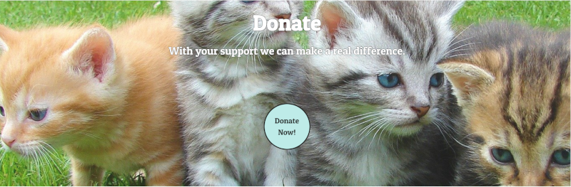

# Milestone Project 1

This responsive website was created for Desktop, Tablets and Mobile view. As part of the first milestone project of CodeInstitute's Full Stack Development Course, this was built as a front end static website using HTML, CSS and Bootstrap.

It was created for the fictional charity CatsUnion, and the website is set up to be bright and elegant in order to induce positive emotions in the user to encourage them to want to support the charity.

-----

## UX

### CatsUnion

This website is built in order to encourage people to support stray, neglected and abandoned Cats and Kittens.

The main purpose of the page is to make visitors want to sponsor a cat, or to donate to the charity.

In addition, there will be an option to adopt a cat, with a selection of cats to choose from.

### User Stories

- As a consumer I want to be able to adopt a Cat or a Kitten to care for.

- As a consumer I want to be able to donate to the charity so I can give my support.

- As a consumer I want to be able to sponsor a Cat to a Kitten so I can give support to a specific cat the charity cares for.

- As a consumer I want some support in how to best take care of Cats and Kittens.

- As a consumer I want to be able to contact the charity.

- As a consumer I want the website to run on different screen sizes.

- As a charity we want users to be able to access our website on desktop and mobile devices.  

- As a charity, we want to explain what we do to help so people know who we are.

- As a charity, we want to be able to allow people to volunteer their times to help us.

- As a supporter, I want to be able to raise funds in other ways so I can give support to the charity.

Use this section to provide insight into your UX process, focusing on who this website is for, what it is that they want to achieve and how your project is the best way to help them achieve these things.

In particular, as part of this section we recommend that you provide a list of User Stories, with the following general structure:

As a user type, I want to perform an action, so that I can achieve a goal.
This section is also where you would share links to any wireframes, mockups, diagrams etc. that you created as part of the design process. These files should themselves either be included as a pdf file in the project itself (in an separate directory), or just hosted elsewhere online and can be in any format that is viewable inside the browser.

###

|     | Feature                        | Importance | Viability |
| --- | ------------------------------ | :--------: | --------: |
| A   | Information about the charity  |     5      |         5 |
| B   | Generate money for the charity |     5      |         4 |
| C   | Adoption Info                  |     3      |         4 |
| D   | Responsive Application Form    |     5      |         4 |
| E   | Location and contact info      |     3      |         4 |
| F   | Cat Care support               |     2      |         4 |
|     | Total                          |     23     |        26 |

### Typography

The following [link](https://www.websitebuilderexpert.com/designing-websites/pick-best-font-style-for-website/) was visited in order to decide which font style to select.
A display type font was chosen as a way to also invoke friendly and playful emotions within the user. 
The selected display font from [google fonts](https://fonts.google.com/specimen/Patua+One?category=Display&sidebar.open&selection.family=DM+Serif+Display|Kaushan+Script|Patua+One) was Patua One as it had the most professional looking appearance of what the website needed to portray. 

### Colours

I used the [color wheel](https://www.canva.com/colors/color-wheel/) in order to decide which colours I used for my website.
I chose a shade of pink as my primary colour in order to portray playfulness and happiness that colour psychology suggests. 
I chose the triadic colour combination to have the colours compliment each other but in a bold way. 
The light yellow is an optimal colour for the donate panel as psychology suggest it invokes feeling of optimism and friendliness. Another emotion the page intends to portray. 
I used the complimentary green for the buttons around the pages which works as psychology suggest it gives a sense of positivity, calmness, health and luck encouraging users to press the buttons. 

Click here to see the project [Wireframes](wireframes.md)

Used [Gimp](https://www.gimp.org/) to create my logo by editing [this](https://pixabay.com/vectors/heart-love-cats-kitten-kitty-2766277/) image. The website font from googlefonts was then added to gimp and then inserted underneath the image to create the logo. 

---

## Features

### Existing Features

#### Adopt

Allows user to see the selection of cats available for adoption and follow a link to contact the charity directly and to find out where to find them.

#### Donate

Allows user to give money to the charity by pressing a button and going to checkout through paypal. (dummy)

#### Sponsor

Allows user to select a cat to sponsor by pressing a button and going to checkout through paypal. (dummy)

#### Videos

Allows users to watch appropriate videos on the page which give support with cat care

#### Navbar

Navbars are used throughout which work effectively to link between all four pages. Logo also leads back to Home. On smaller screens the links become a burger bar.

#### Footer

Footers are used throughout which allow users to use links to appropriate facebook twitter and instagram page. Users can also follow links to important divs of adopt, donate and sponsor. There is also a button for users to click which links to a modal with a map and important contact details.

#### Volunteer Form

Allows users to fill in a form to volunteer. The form includes a file attachment so users can attach their CV's.

### Features Left to Implement

The purchase page of sponsor/donate will eventually link to a paypal purchase page. Currently payment isn't possible so it just informs the user to get in touch with the seller.

---

## Technologies Used

---

### HTML

This project uses HTML to create the main functions of the website.

### CSS

This project uses CSS to manipulate the bootstrap elements to fit how I want them, and to lay out my website specifically to how it was envisioned.

### Bootstrap

This project uses Bootstrap to create the layout.

### GitHub/GitHub Pages

GitHub was used to host the projects code

### Git

Git was required to create check points and push the code onto the GitHub hosting server

### GitPod

Gitpod was used to write code

### W3C HTML Validator

This project used the validator to check the HTML was valid. Any errors were corrected

### W3C Jigsaw Validator

This project used the validator to check the CSS was valid. Any errors were corrected

### Balsamiq

Balsamiq was used to build wireframes for the project

---

## Testing

---

For detailed information of the testing follow the link to the document [here](testing.md)

---

## Deployment

---

In order to deploy the website so it was accessible to others on a variety of devices, the following had to occur
* An index.html was available as the home page
* Developer used git add filenames.extension to put all files into the staged area
* Then the staged files were committed by typing in git commit -m "comments about what have been done in this session of coding" 
* Push the code to gitpod by typing in git push 
* After finding the repository on github, developer followed settings and scrolled down to Github pages
* Source was changed to master branch in order to make it accessible to other
* The following [URL](https://adam181189.github.io/cat-union/) was shared with those who the developer wanted to share it with:https://adam181189.github.io/cat-union/

---

## Credits

---

### Content:

None of the text was copied.

### Media:

The photos used in this site were obtained from ...
[Pixabay](http://pixabay.com)
[Unsplash](http://Unsplash.com)
[Googlemaps](https://www.google.com/maps/place/Little+Wenlock,+Telford/@52.6584399,-2.5252526,16z/data=!3m1!4b1!4m5!3m4!1s0x487078b978614055:0xa3c1b74d6b0c7214!8m2!3d52.658066!4d-2.5225919) (image modified to include fake location)

### Acknowledgements:

I received inspiration for this project from https://www.dogstrust.org.uk/

---

Inline <abbr title="Hypertext Markup Language">HTML</abbr> is supported.
